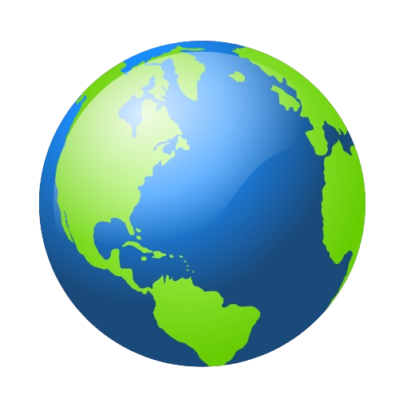

<div align="center">
  <h1 align='center'>Inicializando o Projeto</h1>

  ## Clonando o repositório 

  ```
  git clone https://github.com/MatheusArtur0/reactproject.git

  ```
  ## Instalando dependências 

  ```
  npm install

  ```

  ## Inicializando o localhost:3000

  ```
  npm start

  ```

</div>


<h1 align='center'>Ferramentas Utilizadas</h1>

| Ferramentas                                                                                            | Finalidade               | Link                                           |
|--------------------------------------------------------------------------------------------------------|--------------------------|------------------------------------------------|                          
|      | Prototipação do projeto  | https://trello.com/b/I7PyRCjT/project-coutries |
|   | Gestão do projeto        | https://www.figma.com/design/AAJhIl2SpPhYu1jxTfZXi7/CountriesList?node-id=74-91&t=IGoWwpqyFKQ58eDb-1 |


<div align='center'>
  <h1 align='center'>Contexto</h1>
  
  <h3>CountriesList</h3>

  A CountriesList é uma plataforma web desenvolvida para oferecer aos usuários uma experiência prática e intuitiva na busca por informações sobre os países do mundo. Ao acessar a plataforma o usuário encontra uma interface simples e eficiente, onde todos os países do globo terrestre estão disponíveis.

  Através de uma barra de pesquisa inteligente e filtros avançados, a CountriesList facilita a localização rápida de qualquer país, otimizando o processo de busca com apenas alguns cliques.

  Além disso, ao selecionar e clicar na bandeira de qualquer país, o usuário é redirecionado para uma página dedicada, onde encontrará uma vasta gama de informações sobre o país escolhido, como a moeda oficial, os idiomas falados, aspectos históricos relevantes e detalhes sobre as principais culturas.

  A CountriesList é a solução ideal para quem busca conhecer mais sobre o mundo de forma interativa e simplificada.

</div>